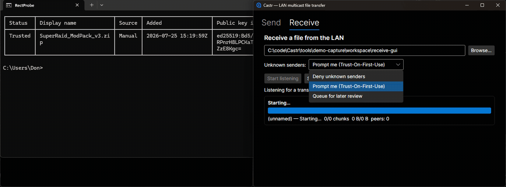

# Castr

A cross-platform LAN multicast file transfer tool. A trusted sender broadcasts a
file once over IP multicast; any number of receivers on the network pick it up
simultaneously, verify it via a signed, chunk-hashed manifest, decrypt it (chunk
payloads are encrypted end-to-end with ChaCha20-Poly1305, not just signed — see
below), and repair any lost chunks by requesting them from peer receivers rather
than re-asking the sender.

Runs on Windows, macOS, and Linux with full IP multicast; iOS and Android join the
same swarm as unicast clients over LAN-discovered peers, since neither OS allows
apps to reliably join true multicast groups.

## See it in action

<p align="center"></p>

One sender, any number of receivers, one broadcast — a LAN party mod pack push, a
sysadmin scripting a fleet config rollout, a test lab loading the same dataset onto
every bench machine at once. **[See all three, with GIFs of the CLI, the colorful
TUI dashboard, and the desktop GUI →](docs/SHOWCASE.md)**

## Status

M0 (scaffolding) through M6 are complete: M5 shipped the showcase docs
below, and M6 root-caused and fixed a real send/receive throughput
bottleneck (see "See it in action" below and
`wiki/synthesis/m6-throughput-pipelining.md`) — formal release automation
(tag-triggered releases, checksums/signatures) remains open, tracked in
`wiki/synthesis/roadmap.md`. Chunk payloads are ChaCha20-Poly1305-encrypted end-to-end and
travel over MTU-safe wire packets (chunks split/reassembled below the
crypto layer) — see `wiki/synthesis/m1.5-encryption-summary.md` and
`wiki/synthesis/m3-test-ci-hardening-summary.md`.
`castr send`/`castr receive`/`castr trust`, a live Spectre.Console dashboard
(`--tui`), and an Avalonia desktop GUI are all working — see
`wiki/synthesis/m2-ui-summary.md`. Mobile (iOS/Android) joins as a unicast
swarm client over LAN-discovered peers (native `NsdManager`/`NWBrowser`
discovery, TCP pull, the same signed-manifest/Merkle/AEAD verification the
desktop multicast tier uses) — `Castr.Gui.Android` produces a real
debug-signed sideloadable APK; `Castr.Gui.iOS` builds and links its native
discovery bindings against real Xcode, though the full app-level Simulator
link is currently blocked by an upstream `libsodium` packaging gap — see
`wiki/synthesis/m4-mobile-summary.md`. CI runs a real 3-OS build+test matrix,
a Docker-gated multi-container E2E fan-out job with real induced packet
loss, and dedicated Android/iOS mobile-build workflows on real
SDK/Xcode-provisioned runners — see `wiki/synthesis/m3-test-ci-hardening-summary.md`
and `wiki/synthesis/m4-mobile-summary.md`. See `wiki/synthesis/roadmap.md` for milestone status and
`wiki/` generally for the accumulated design decisions (ADRs, spike results). The
full architecture — wire protocol, repair algorithm, security model, and milestone
plan — lives in the project plan; a synthesis of it is ingested into `wiki/` as the
project's first source so it survives session restarts.

## Repo layout

- `src/Castr.Core` — protocol state machines, chunker, Merkle/manifest, trust
  store, transport abstractions (no UI, no platform-specific code)
- `src/Castr.Core.Discovery` — peer discovery abstraction + platform mDNS impls
  (used by the mobile unicast tier)
- `src/Castr.Cli` — command-line entrypoint (System.CommandLine): `send`,
  `receive`, `trust list|add|block|remove`
- `src/Castr.Tui` — colorful live transfer dashboard (Spectre.Console),
  consumed by `Castr.Cli --tui`
- `src/Castr.Gui`, `src/Castr.Gui.Desktop` — Avalonia GUI: shared
  views/viewmodels and the Windows/macOS/Linux desktop head
- `src/Castr.Gui.Android`, `src/Castr.Gui.iOS` — Avalonia mobile GUI heads
  (unicast swarm client), built on top of `Castr.Core.Discovery` + the TCP
  swarm-pull tier in `Castr.Core`; each opt-in-multitargeted so a default
  `dotnet build`/CI matrix never requires mobile workloads
- `tests/` — unit, loopback-multicast integration, CLI, TUI, GUI, and
  discovery test projects, one per corresponding `src/` project's concerns,
  plus `Castr.Core.E2ETests`: a Testcontainers-driven multi-container
  fan-out suite (real Docker bridge multicast + kernel-level `tc netem`
  loss), opt-in via `CASTR_E2E=1` and gated on Docker being reachable
- `wiki/`, `raw/` — the project's persistent knowledge base (llm-wiki), the
  durable memory across sessions
- `graphify-out/` — generated codebase knowledge graph (query this instead of
  re-reading the whole tree when resuming work)

## Building

```
dotnet build
dotnet test
```

Requires the .NET 10 SDK (LTS, pinned via `global.json`).

Every push to `main` also builds self-contained, per-platform zips of `castr` (CLI) and the desktop GUI for
win-x64, win-arm64, osx-x64, osx-arm64, and linux-x64, uploaded as downloadable artifacts on that CI run's
Actions page (see the `package` job in `.github/workflows/ci.yml`). These are unsigned CI convenience builds,
not versioned/checksummed releases — that's tracked for M5.

## License

Apache-2.0 — see [LICENSE](LICENSE).
