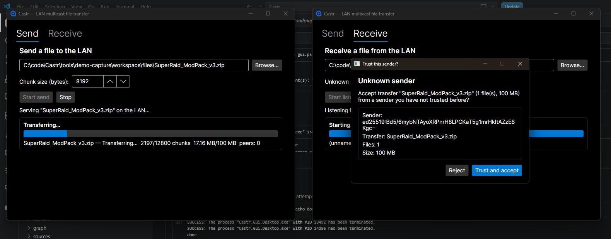
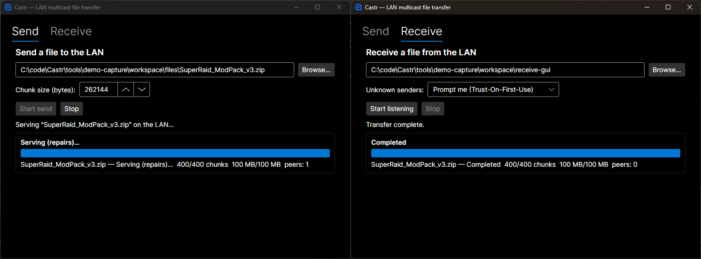
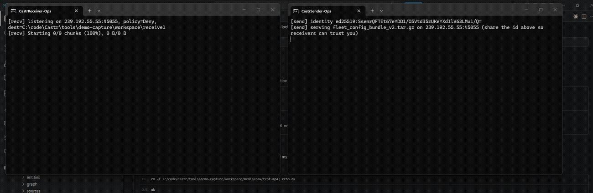
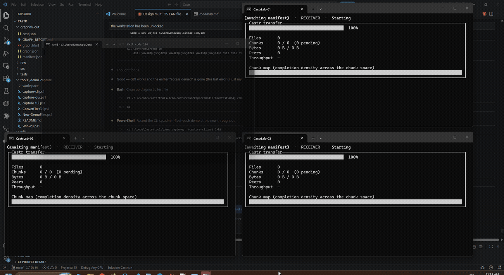

# Castr in action

Three real, unscripted-except-for-the-file-names transfers, captured from the actual shipped binaries on this repo's `main` branch — the desktop GUI, the CLI, and the TUI dashboard, each doing the thing it's best at. No mockups: every screenshot and GIF below is a real multicast transfer over a real (loopback) network, chunk-hashed, Merkle-verified, and end-to-end encrypted the same way it would be on a real LAN.

## 🎮 The LAN party — desktop GUI

You just finished downloading a 100 MB mod pack and five other people at the table need it before the next round starts. Nobody wants to be the bottleneck passing a USB stick around, and the venue Wi-Fi is not going to survive six people pulling the same file from a cloud link at once.

Open Castr, drop the file in, hit **Start send**. Everyone else's Castr window lights up with an unknown-sender prompt showing exactly who's sending, what, and how big — they read your name off it, click **Trust and accept**, and the transfer just starts. One broadcast, everyone downloading in parallel, off the LAN entirely.

<p align="center"></p>

That trust prompt is the whole security model made visible — nothing downloads until a human looks at the sender's identity and says yes:

<p align="center"></p>

...and because every chunk is Merkle-verified and AEAD-decrypted as it lands, "done" really is done — byte-identical, not "probably fine":

<p align="center"></p>

If a laptop was asleep and missed the first few seconds, that's fine too — it joins late, and repair traffic fills it in from whichever peer already has the missing chunks, not just from you.

## 🖥️ The fleet push — headless CLI

A sysadmin needs the same config bundle on every box in a rack, right now, without SSH-looping through them one at a time or standing up a file server for a one-off push. `castr` is a single static binary per platform (Windows/macOS/Linux) with no daemon and no cloud dependency — it fits straight into a provisioning script.

```
castr send fleet_config_bundle_v2.tar.gz --identity ops-signing.key
castr receive --dest-dir /etc/fleet-config --trust-store ops-trusted-senders.json
```

One sender, any number of listeners on the segment, all pulling from the same multicast stream in parallel — pushing to 3 machines costs the same wall-clock time as pushing to 30. Trust is enforced by a pre-seeded `trusted-senders.json` baked into the fleet image, so a rogue host on the same subnet can announce all it wants and every receiver ignores it by default.

<p align="center"></p>

## 🧪 The test lab — the colorful TUI

A test lab needs the exact same multi-gigabyte dataset on every bench machine before a run starts — and "exact same" has to mean cryptographically verified identical, not "the copy that happened to finish." `castr send --tui` (or `receive --tui`) swaps the plain progress lines for a live Spectre.Console dashboard: a chunk-completion heatmap, per-peer throughput, and a running tally of what's left.

This is the "one send, hundreds of receive" story made visible — one sender, three lab machines, all filling up in lockstep off a single broadcast:

<p align="center"></p>

Every panel is a real, independent `castr receive --tui` process — nothing here is simulated or mirrored. Watch the `Peers` count, the throughput, and the chunk map percentages: they're each converging on 100% at their own pace, exactly as they would across an actual rack of machines.

## How these were made

Every asset on this page is a real capture of `main`'s actual `Castr.Cli`/`Castr.Tui`/`Castr.Gui.Desktop` binaries, sending real (sparse-allocated, correctly-sized) demo files over real loopback IP multicast — chunked, BLAKE3-hashed, Merkle-proofed, ChaCha20-Poly1305-encrypted, and verified on arrival exactly as a real cross-machine transfer would be. Screen capture used `ffmpeg`'s `ddagrab` (DXGI Desktop Duplication) rather than the older `gdigrab`, since Windows Terminal's GPU-composited rendering desaturates badly under legacy GDI BitBlt capture. The capture scripts themselves are saved in [`tools/demo-capture/`](../tools/demo-capture/) so this media can be regenerated later.

## What's not shown here yet

`Castr.Gui.Android` and `Castr.Gui.iOS` (see [`m4-mobile-summary`](../wiki/synthesis/m4-mobile-summary.md)) are real, CI-verified-building mobile heads, but this dev machine has no Android emulator and no Mac/Xcode to run them on for a screen capture — that's a genuine gap, not an oversight, and a good candidate for a follow-up once mobile hands-on testing (already an open item in [the roadmap](../wiki/synthesis/roadmap.md)) happens on real hardware.
